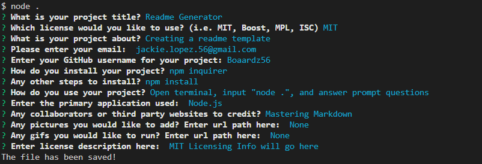

# Readme Generator

  

  ## Description

  Creating a README.md template using a CLI App

  ### Contact Information
  Email:  jackie.lopez.56@gmail.com  
  GitHub: https://github.com/Boaardz56

  ## Table of Contents
  * [Installation](#installation)
  * [Usage](##usage)
  * [Credits](##credits)
  * [Tests](##tests)
  * [License](##license)
    
  ## Installation

    npm inquirer
    npm install

  ## Usage 

  > Open terminal, input "node .", and answer prompt questions
  * Node.js

  ## Credits

  [Mastering Markdown](https://guides.github.com/features/mastering-markdown/)

  ## Tests

    

  
      
  ## License

  MIT Licensing info will go here